# Architecture

## Components

```text
React Frontend
    |
    v
Spring Boot Backend ----> PostgreSQL
    |
    v
Kafka
    |
    v
Python Worker ---------> PostgreSQL
```

## System Design Diagram

```mermaid
flowchart LR
    subgraph Client["Client Layer"]
        UI["React Frontend<br/>Vite App<br/><br/>- Register/Login<br/>- View Departments<br/>- View Doctors<br/>- Fetch Available Slots<br/>- Book/Cancel Appointment<br/>- Poll Status Timeline"]
        LocalStorage["Browser localStorage<br/>JWT Token"]
    end

    subgraph Backend["Spring Boot Backend"]
        AuthController["Auth Controller<br/><br/>POST /api/auth/register<br/>POST /api/auth/login"]
        CatalogueController["Catalogue Controllers<br/><br/>GET /api/departments<br/>GET /api/departments/{id}/doctors<br/>GET /api/doctors/{id}/slots"]
        AppointmentController["Appointment Controller<br/><br/>GET /api/appointments<br/>POST /api/appointments<br/>DELETE /api/appointments/{id}<br/>GET /api/appointments/{id}/events"]
        JwtFilter["JWT Auth Filter<br/>Validates Bearer Token"]
        Services["Service Layer<br/><br/>- AuthService<br/>- AppointmentService<br/>- Slot/Doctor/Department Services<br/>- Validation<br/>- Ownership Checks<br/>- Friendly Conflict Errors"]
        Repositories["Repository Layer<br/>Spring Data JPA"]
        EventPublisher["Kafka Event Publisher<br/><br/>Publishes after DB commit"]
        Swagger["Swagger/OpenAPI Docs<br/>/swagger-ui.html"]
    end

    subgraph DB["PostgreSQL Database"]
        Users["users<br/><br/>id<br/>name<br/>email unique<br/>password_hash<br/>timestamps"]
        Departments["departments<br/><br/>id<br/>name<br/>timestamps"]
        Doctors["doctors<br/><br/>id<br/>department_id<br/>name<br/>specialization<br/>timestamps"]
        Slots["appointment_slots<br/><br/>id<br/>doctor_id<br/>start_datetime<br/>end_datetime<br/>timestamps"]
        Appointments["appointments<br/><br/>id<br/>user_id<br/>slot_id<br/>start_datetime<br/>end_datetime<br/>status<br/>timestamps"]
        EventLogs["appointment_event_logs<br/><br/>id<br/>appointment_id<br/>event_type<br/>event_id<br/>correlation_id<br/>old_status<br/>new_status<br/>message<br/>created_at"]
        ProcessedEvents["processed_events<br/><br/>event_id PK<br/>event_type<br/>appointment_id<br/>processed_at"]
        Constraints["DB Constraints<br/><br/>1. Unique active appointment per slot<br/>2. No overlapping active appointments per user<br/>3. Unique user email<br/>4. Status checks"]
    end

    subgraph Messaging["Messaging Layer"]
        Kafka["Kafka Broker"]
        Topic["Topic: appointment.events<br/><br/>Event Types:<br/>APPOINTMENT_CREATED<br/>APPOINTMENT_CANCELLED"]
    end

    subgraph Worker["Python Worker Service"]
        Consumer["Kafka Consumer<br/>Consumes appointment.events"]
        Processor["Appointment Processor<br/><br/>- Parse Event<br/>- Check Idempotency<br/>- Update Status<br/>- Simulate Notification<br/>- Write Audit Log"]
        WorkerDBClient["PostgreSQL Client<br/>Transactional Writes"]
    end

    subgraph Infra["Dockerized Local Stack"]
        Compose["compose.yml<br/><br/>Runs:<br/>- Frontend<br/>- Backend<br/>- Worker<br/>- PostgreSQL<br/>- Kafka"]
        Flyway["Flyway Migrations<br/><br/>Schema<br/>Indexes<br/>Constraints<br/>Seed Data"]
    end

    UI -->|"Register/Login"| AuthController
    AuthController -->|"JWT"| UI
    UI --> LocalStorage
    LocalStorage -->|"Authorization: Bearer token"| UI
    UI -->|"Fetch departments/doctors/slots"| CatalogueController
    UI -->|"Create/Cancel/View appointments"| AppointmentController
    UI -->|"Poll appointment timeline"| AppointmentController

    AppointmentController --> JwtFilter
    CatalogueController --> Services
    AuthController --> Services
    JwtFilter --> Services
    Services --> Repositories
    Repositories --> DB
    Services -->|"After successful appointment creation/cancellation"| EventPublisher
    EventPublisher --> Kafka
    Kafka --> Topic
    Swagger -.-> Backend

    Departments --> Doctors
    Doctors --> Slots
    Users --> Appointments
    Slots --> Appointments
    Appointments --> EventLogs
    Constraints --> Appointments

    Topic --> Consumer
    Consumer --> Processor
    Processor --> WorkerDBClient
    WorkerDBClient --> ProcessedEvents
    WorkerDBClient --> Appointments
    WorkerDBClient --> EventLogs

    Compose -.-> UI
    Compose -.-> Backend
    Compose -.-> Worker
    Compose -.-> DB
    Compose -.-> Kafka
    Flyway -.-> DB
```



## Responsibilities

| Component | Responsibilities |
| --- | --- |
| React frontend | Login/register, slot selection, booking, cancellation, appointment history, processing timeline |
| Spring Boot backend | REST APIs, JWT authentication, validation, database writes, Kafka event publishing, Swagger docs |
| PostgreSQL | Users, doctors, slots, appointments, event logs, idempotency records, booking constraints |
| Kafka | Appointment event transport between backend and worker |
| Python worker | Kafka consumption, idempotency, status transitions, notification audit event, direct DB updates |

## Booking Flow

```text
User submits appointment request
    |
    v
Backend validates JWT and slot
    |
    v
Backend checks active overlapping appointments
    |
    v
PostgreSQL enforces slot and user-overlap constraints
    |
    v
Backend stores appointment as CREATED
    |
    v
Backend publishes APPOINTMENT_CREATED event after commit
    |
    v
Worker consumes event from Kafka
    |
    v
Worker records eventId in processed_events
    |
    v
Worker updates appointment CREATED -> PROCESSING -> CONFIRMED
    |
    v
Worker writes NOTIFICATION_PROCESSED audit event
    |
    v
Frontend polling shows updated status and timeline
```

## Cancellation Flow

```text
User cancels appointment
    |
    v
Backend validates ownership
    |
    v
Backend sets appointment to CANCELLED
    |
    v
Backend writes event log and publishes APPOINTMENT_CANCELLED
    |
    v
Worker records event as processed and skips status mutation
```

## Event Identity And Tracing

The platform uses two identifiers for different purposes:

- `eventId`: unique per Kafka event; used for worker idempotency.
- `correlationId`: shared across one user workflow; used for logs and audit traceability.

This keeps duplicate message handling separate from request tracing.

## Why The Worker Updates The Database Directly

The worker writes directly to PostgreSQL so idempotency, status updates, and audit log inserts happen in one transaction. This avoids an additional backend HTTP retry path and keeps duplicate Kafka delivery easy to reason about.

## Current Notification Design

The assignment asks for notification processing. This implementation records notification processing as a `NOTIFICATION_PROCESSED` audit event after confirmation. That demonstrates the asynchronous notification step without adding a real email/SMS provider.
